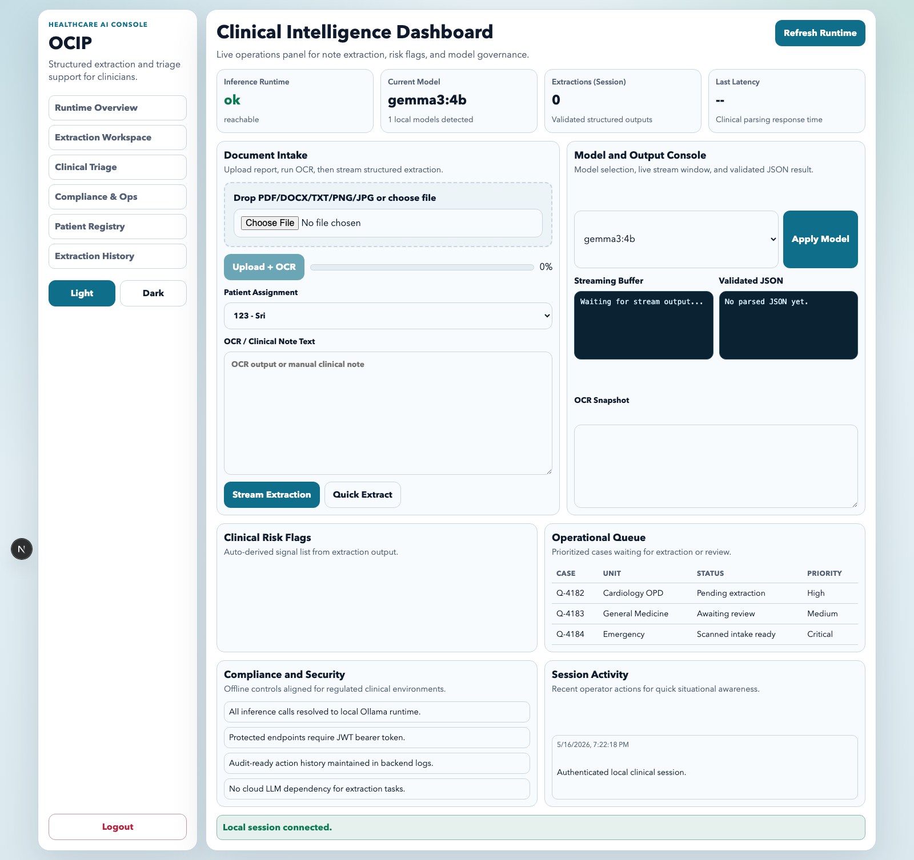
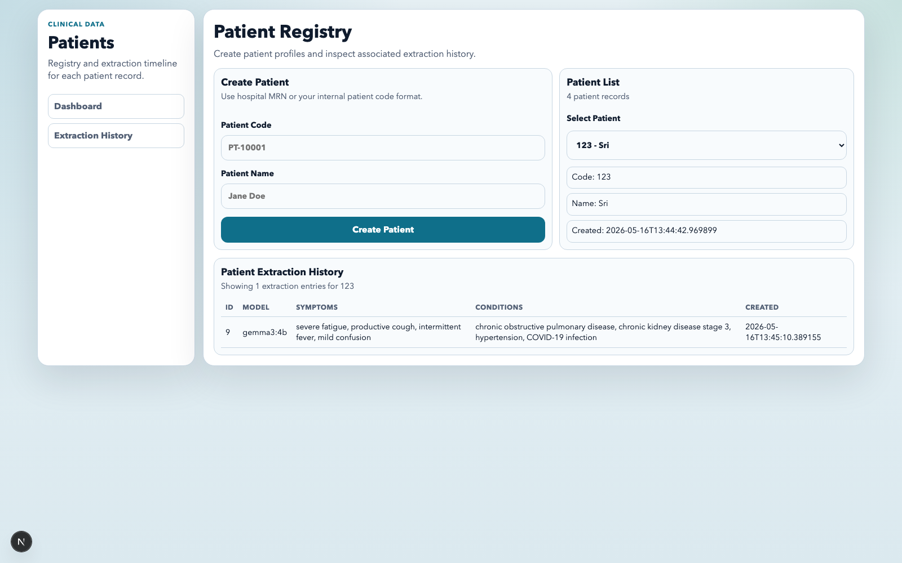
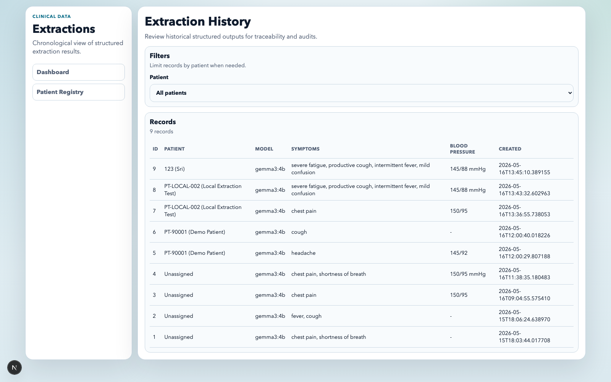
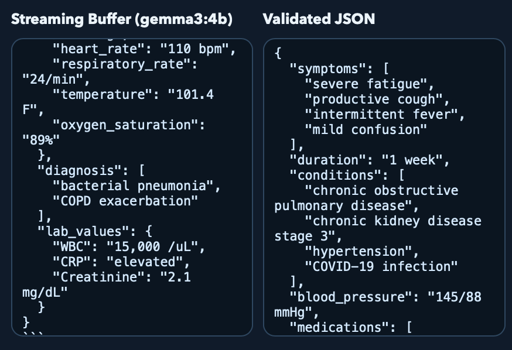

# Offline Clinical Intelligence Platform

Privacy-first clinical extraction platform that runs fully offline using local LLM inference via Ollama.

## Stack
- Frontend: Next.js 15 (App Router), React
- Backend: FastAPI (Python 3.11+)
- Local LLM runtime: Ollama (OpenAI-compatible local endpoint)
- OCR: Tesseract + format-specific parsing (PDF/TXT/DOCX/PNG/JPG)
- Local vector store: ChromaDB

## Key capabilities
- Local-only model inference (no cloud LLM calls)
- Drag-and-drop uploads
- OCR pipeline for scans and reports
- Structured JSON extraction with schema validation + retries
- Streaming extraction responses (SSE)
- Long-note chunking and merge strategy
- JWT authentication + role checks
- Audit logs and request latency headers
- Dockerized local/on-prem deployment

## Monorepo structure
```text
offline-clinical-ai/
├── frontend/
├── backend/
├── docker/
├── docs/
├── data/
├── tests/
└── docker-compose.yml
```

## Local setup

### 1) Start Ollama and pull model
```bash
ollama serve
ollama pull gemma3:4b
```

### 2) Backend
```bash
python3.11 -m venv .venv
source .venv/bin/activate
pip install -r backend/requirements.txt
cp backend/.env.example backend/.env
uvicorn backend.main:app --reload --port 8000
```

### 3) Frontend
```bash
cd frontend
npm install
npm run dev
```

### One-click local run
```bash
./scripts/dev-start.sh
./scripts/dev-status.sh
./scripts/dev-stop.sh
```

### Alternative backend launch from `backend/`
```bash
cd backend
python3.11 -m venv .venv
source .venv/bin/activate
pip install -r requirements.txt
cp .env.example .env
PYTHONPATH=.. uvicorn backend.main:app --reload --port 8000
```

Frontend: `http://localhost:3000`
Backend: `http://localhost:8000`

## Vercel deployment
Frontend-only deployment is supported on Vercel.

1. Import repository in Vercel.
2. Set project `Root Directory` to `frontend`.
3. Add env var: `NEXT_PUBLIC_API_BASE_URL=https://<your-backend-host>`.
4. Deploy.

Live frontend display deployment:
- https://medical-rag-engine-five.vercel.app

For full details, see [docs/VERCEL_DEPLOYMENT.md](docs/VERCEL_DEPLOYMENT.md).

Important: a fully offline privacy-first deployment (`FastAPI + Ollama` local inference) cannot be fully hosted on Vercel.

## UI Screenshots
### Dashboard


### Patient Registry


### Extraction History


### JSON Extraction


## Docker offline deployment
```bash
docker compose up --build
```

## API endpoints
- `GET /health`
- `POST /auth/login`
- `POST /upload`
- `POST /ocr`
- `POST /extract`
- `POST /extract/stream`
- `POST /extract/from-upload`
- `GET /models`
- `POST /models/select`
- `GET /admin/audit-logs`
- `POST /patients`
- `GET /patients`
- `GET /patients/{patient_id}/history`
- `GET /extractions`

Full endpoint contract: [docs/API.md](docs/API.md)

## Example extraction output
```json
{
  "symptoms": ["chest pain"],
  "duration": "3 days",
  "conditions": ["hypertension", "diabetes"],
  "blood_pressure": "150/95",
  "medications": ["aspirin 75mg"],
  "allergies": [],
  "vitals": {},
  "diagnosis": [],
  "lab_values": {}
}
```

## Security notes
- Inference is routed only to configured local Ollama endpoint.
- JWT is required for protected endpoints.
- Sensitive documents remain on local storage.
- Replace `JWT_SECRET` before production.
- Place services behind local TLS reverse proxy for HTTPS.

## Roadmap alignment
- Phase 1-3 included in this baseline.
- RAG, vector retrieval integration, and multi-agent pipeline architecture are scaffolded for Phase 4-5.
