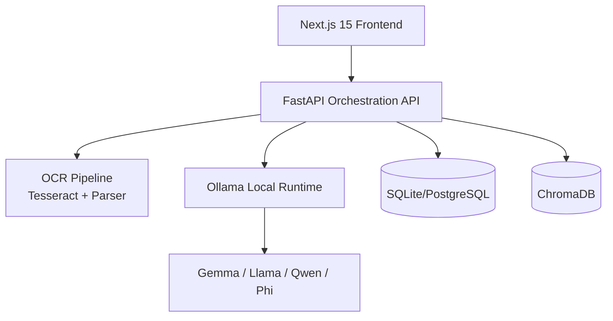

# Architecture

## Data flow
1. User uploads file from dashboard.
2. Backend stores file locally and extracts text via parser/OCR.
3. Text is chunked when needed for context-safe processing.
4. Prompt orchestration calls local Ollama model.
5. Response is validated with Pydantic schema and retried on malformed output.
6. SSE stream sends partial output + final validated JSON to frontend.
7. Audit logs and extraction records are persisted locally.

## Security controls
- No cloud inference dependency
- JWT-based API protection
- Admin role checks for model controls
- Local persistence and network-local service topology
